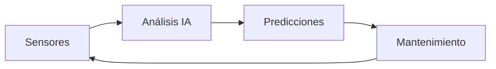

# El Impacto de la IA en la Ingeniería Civil

## Introducción

La Inteligencia Artificial (IA) está revolucionando numerosos campos, y la ingeniería civil no es una excepción. En este artículo, exploraremos cómo la IA está transformando la práctica de la ingeniería civil y mejorando la eficiencia en proyectos de infraestructura.

## 1. Diseño Generativo y Optimización

### Innovación en Diseño

> El diseño generativo mediante IA permite explorar múltiples soluciones optimizadas en una fracción del tiempo tradicional.

La IA permite:

- ✨ Creación de múltiples opciones de diseño
- 💰 Optimización de costos de materiales
- 🏗️ Mejora en eficiencia estructural
- 🔄 Iteraciones rápidas de diseño

### Análisis Estructural Avanzado

La IA mejora el análisis estructural mediante:

1. Simulaciones complejas en tiempo real
2. Predicción de comportamiento estructural
3. Optimización de diseños sísmicos
4. Análisis de fatiga de materiales

## 2. Mantenimiento Predictivo

### Monitoreo Inteligente



La IA revoluciona el mantenimiento:

- 📊 Análisis de datos en tiempo real
- 🔍 Predicción de fallos estructurales
- ⚡ Optimización de ciclos
- 💵 Reducción de costos

### Gestión de Activos

| Aspecto | Beneficio |
|---------|-----------|
| Evaluación | Automática y continua |
| Priorización | Basada en datos |
| Recursos | Optimizados |
| Vida útil | Extendida |

## 3. Optimización de la Construcción

### Planificación Inteligente

*La IA mejora la planificación mediante:*

- **Optimización** de cronogramas
- **Asignación** eficiente de recursos
- **Predicción** de retrasos
- **Gestión** de riesgos

### Automatización de Procesos


1. Control de calidad automatizado
2. Robótica en construcción
3. Drones para inspección
4. Fabricación digital

## 4. Sostenibilidad y Eficiencia Energética

### Diseño Sostenible

La IA impulsa la sostenibilidad mediante:

- 🌱 Optimización energética
- 🌍 Reducción de huella de carbono
- ♻️ Materiales sostenibles
- 🗑️ Gestión de residuos

### Análisis de Impacto Ambiental

- [ ] Simulaciones ambientales
- [ ] Predicción de impactos
- [ ] Mitigación de riesgos
- [ ] Cumplimiento normativo

## 5. Casos de Éxito

### Proyecto Puente Inteligente

> "La implementación de IA en el monitoreo estructural redujo los costos de mantenimiento en un 40%"

- Monitoreo estructural en tiempo real
- Predicción de mantenimiento
- Reducción de costos operativos
- Mayor seguridad

### Edificio Sostenible AI-Drive

```typescript
interface EdificioInteligente {
  energía: "optimizada";
  emisiones: "reducidas";
  confort: "mejorado";
  costos: "minimizados";
}
```

## Conclusión

La IA está transformando fundamentalmente la ingeniería civil, ofreciendo:

1. Mayor eficiencia en diseño y construcción
2. Mejora en seguridad y mantenimiento
3. Sostenibilidad mejorada
4. Reducción de costos
5. Innovación continua

## Perspectivas Futuras

Las tendencias emergentes incluyen:

- 📱 Integración con IoT y 5G
- 🕶️ Realidad aumentada en construcción
- 🔄 Gemelos digitales
- 🤖 Construcción autónoma
- 🧪 Materiales inteligentes

---

*La evolución continua de la IA seguirá transformando la ingeniería civil, creando nuevas oportunidades y desafíos para los profesionales del sector.*