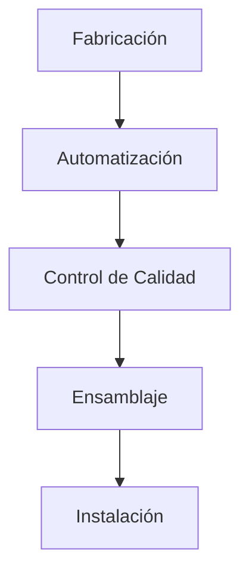

# Innovaciones en Construcción Modular

## Introducción

La construcción modular está transformando la industria de la construcción, ofreciendo soluciones más rápidas, eficientes y sostenibles. En este artículo, exploraremos las últimas innovaciones en este campo y su impacto en el futuro de la construcción.

## 1. Fabricación Fuera del Sitio

### Ventajas de la Fabricación Controlada

> La fabricación en entorno controlado revoluciona la calidad y eficiencia en la construcción.

La fabricación controlada ofrece:

- ✅ Mayor precisión en la producción
- ✅ Control de calidad superior
- ✅ Reducción de desperdicios
- ✅ Optimización de procesos

### Tecnologías Avanzadas



Implementación de tecnologías modernas:

1. Automatización robótica
2. Impresión 3D
3. Control digital de calidad
4. Sistemas de gestión integrados

## 2. Integración de IoT y Tecnología Smart

### Edificios Inteligentes

| Característica | Beneficio |
|---------------|-----------|
| Sensores | Monitoreo en tiempo real |
| Automatización | Control eficiente |
| Conectividad | Gestión remota |
| Análisis | Optimización continua |

### Conectividad y Datos

*Beneficios de la conectividad:*

- 📊 Mantenimiento predictivo
- ⚡ Optimización operativa
- 📈 Análisis de rendimiento
- 🔄 Mejora continua

## 3. Materiales Avanzados

### Innovación en Materiales


Nuevos materiales utilizados:

- 🏗️ Compuestos de fibra de carbono
- ♻️ Materiales reciclados
- 🌡️ Aislantes de alto rendimiento
- 🔧 Materiales autorreparables

### Sostenibilidad

Enfoque en sostenibilidad mediante:

1. Reducción de huella de carbono
2. Eficiencia energética
3. Reciclabilidad
4. Durabilidad mejorada

## 4. Diseño y Personalización

### Flexibilidad en Diseño

```typescript
interface DiseñoModular {
  adaptabilidad: "alta";
  configuraciones: "flexibles";
  acabados: "personalizados";
  escalabilidad: "garantizada";
}
```

### Eficiencia Espacial

- [ ] Diseños multifuncionales
- [ ] Espacios transformables
- [ ] Almacenamiento integrado
- [ ] Ergonomía mejorada

## 5. Casos de Éxito

### Proyecto Residencial Modular

**Resultados:**
- 📉 Reducción del 40% en tiempo
- 💰 Ahorro del 20% en costos
- ⭐ Calidad superior
- 😊 Satisfacción del cliente

### Centro Comercial Modular

- 🏗️ Construcción rápida
- 🎨 Flexibilidad de diseño
- 🌱 Eficiencia energética
- 🌍 Bajo impacto ambiental

## 6. Beneficios Económicos

### Reducción de Costos

> La construcción modular puede reducir los costos totales del proyecto hasta en un 30%.

Ventajas económicas:
1. Menor tiempo de construcción
2. Reducción de desperdicios
3. Eficiencia en mano de obra
4. Economías de escala

### ROI Mejorado

| Aspecto | Beneficio |
|---------|-----------|
| Ocupación | Más rápida |
| Costos | Reducidos |
| Valor | Superior |
| Flexibilidad | Aumentada |

## Conclusión

La construcción modular representa el futuro de la industria, ofreciendo:

1. Mayor eficiencia y rapidez
2. Sostenibilidad mejorada
3. Calidad superior
4. Costos optimizados
5. Flexibilidad sin precedentes

## Perspectivas Futuras

El futuro de la construcción modular incluye:

- 🤖 Mayor automatización
- 🧠 Integración de IA
- 🔬 Materiales innovadores
- 🎨 Personalización avanzada
- 🌱 Sostenibilidad mejorada

---

*La construcción modular continuará evolucionando, ofreciendo soluciones cada vez más eficientes y sostenibles para las necesidades constructivas del futuro.*