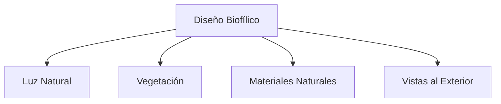

# Tendencias en Arquitectura Sustentable para 2023

## Introducción

La arquitectura sustentable está en auge, y 2023 promete ser un año lleno de innovaciones en este campo. En este artículo, exploraremos las principales tendencias que están dando forma al futuro de la construcción ecológica.

## 1. Materiales Biobasados

> Los materiales biobasados representan el futuro de la construcción sostenible.

### Innovaciones en Materiales

Los materiales biobasados, derivados de fuentes renovables, están ganando popularidad:

- 🌱 Bambú estructural
- 🍄 Compuestos de micelio
- 🌾 Fibras naturales
- ♻️ Materiales reciclados

### Beneficios Ambientales

1. Huella de carbono reducida
2. Biodegradabilidad
3. Recursos renovables
4. Menor impacto ambiental

## 2. Diseño Biofílico

### Integración con la Naturaleza



### Elementos Clave

| Elemento | Beneficio |
|----------|-----------|
| Jardines Verticales | Purificación del aire |
| Luz Natural | Bienestar ocupantes |
| Materiales Naturales | Conexión con naturaleza |
| Espacios Verdes | Reducción estrés |

## 3. Edificios de Energía Neta Cero

### Tecnologías Implementadas


- ☀️ Paneles solares integrados
- 🌡️ Sistemas de gestión térmica
- 💡 Iluminación inteligente
- 🔋 Almacenamiento de energía

### Estrategias de Eficiencia

*Elementos clave para lograr energía neta cero:*

1. Aislamiento superior
2. Ventanas de alto rendimiento
3. Sistemas HVAC eficientes
4. Monitoreo en tiempo real

## 4. Automatización y Control

### Sistemas Inteligentes

```typescript
interface EdificioInteligente {
  energía: "optimizada";
  confort: "personalizado";
  seguridad: "avanzada";
  mantenimiento: "predictivo";
}
```

### Beneficios

- [ ] Reducción de consumo energético
- [ ] Mejora del confort ocupacional
- [ ] Mantenimiento predictivo
- [ ] Optimización de recursos

## 5. Certificaciones y Estándares

### Principales Certificaciones

1. LEED Platinum
2. BREEAM Outstanding
3. WELL Building Standard
4. Living Building Challenge

### Criterios de Evaluación

- 📊 Eficiencia energética
- 💧 Gestión del agua
- 🌱 Materiales sostenibles
- 👥 Bienestar ocupantes

## 6. Innovaciones en Diseño

### Elementos Arquitectónicos

- 🏢 Fachadas dinámicas
- 🌿 Techos verdes
- 🌞 Atrios solares
- 💨 Ventilación natural

### Espacios Adaptables

> Los espacios flexibles y adaptables son esenciales en la arquitectura sustentable moderna.

## Conclusión

La arquitectura sustentable no es solo una tendencia, sino una necesidad para un futuro más verde y resiliente. Las innovaciones en:

1. Materiales biobasados
2. Diseño biofílico
3. Eficiencia energética
4. Automatización
5. Certificaciones

están transformando la manera en que diseñamos y construimos.

## Llamado a la Acción

¿Estás listo para ser parte de este cambio?

- 🏗️ Adopta prácticas sustentables
- 📚 Mantente informado
- 🤝 Colabora con expertos
- 🌱 Impulsa el cambio

---

*La arquitectura sustentable es el camino hacia un futuro más verde y saludable para todos.*